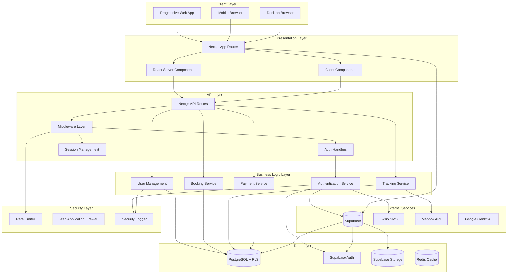
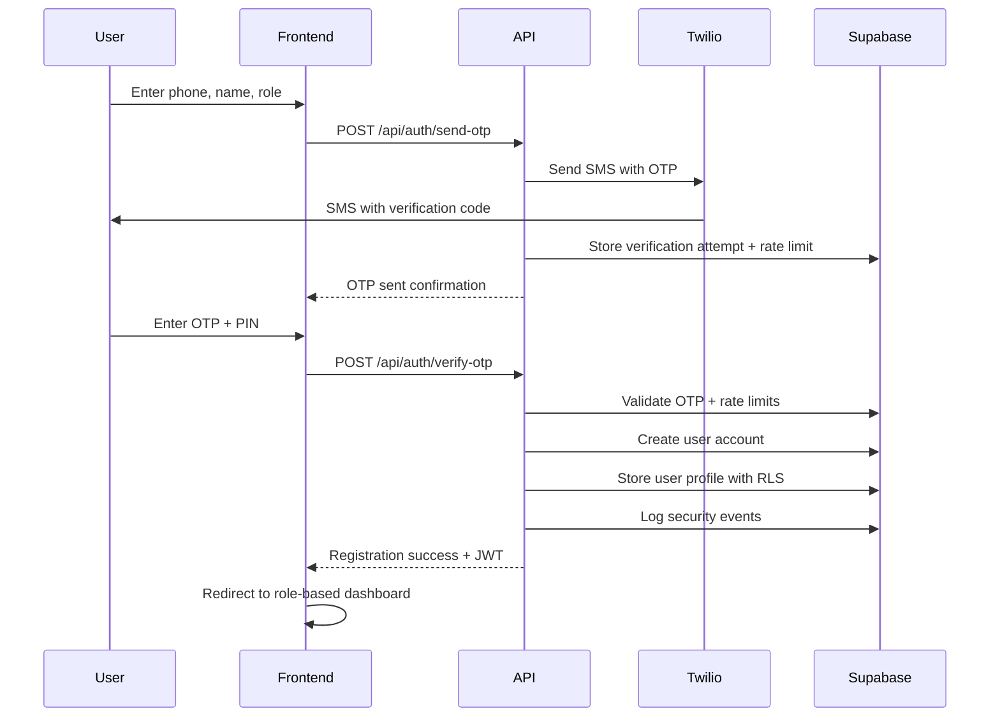
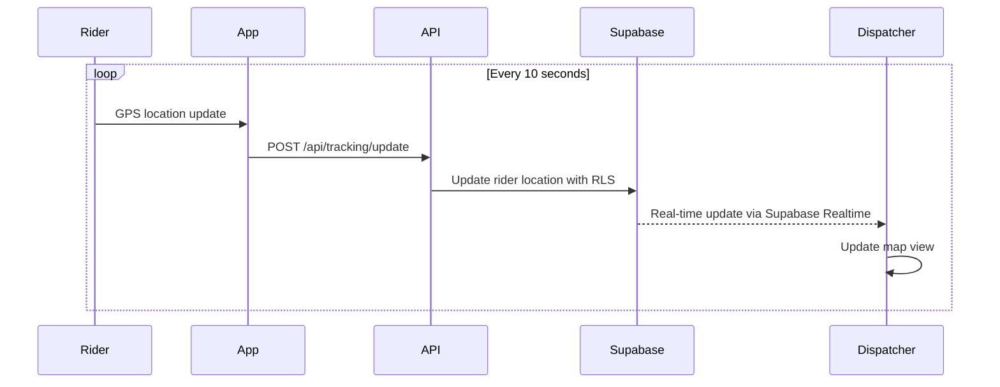

# GoTryke Architecture Documentation

## Executive Summary

GoTryke is a modern, multi-role transportation management web application designed for tricycle transport systems in the Philippines. Built with Next.js 15 and **Supabase**, it provides a comprehensive platform for managing passengers, riders, dispatchers, and administrators with real-time tracking, secure authentication, and intelligent dispatching capabilities.

---

## Table of Contents

1. [System Overview](#system-overview)
2. [Technology Stack](#technology-stack)
3. [Architecture Diagram](#architecture-diagram)
4. [Core Modules](#core-modules)
5. [Dependencies](#dependencies)
6. [Security Architecture](#security-architecture)
7. [Data Flow](#data-flow)
8. [Deployment Architecture](#deployment-architecture)

---

## System Overview

### Application Type
- **Platform**: Progressive Web Application (PWA)
- **Architecture Pattern**: Microservices with Serverless Functions
- **Framework**: Next.js App Router (React Server Components)
- **Deployment**: Vercel/Cloud Platform

### Key Features
- Multi-role authentication system (Admin, Dispatcher, Guide, Passenger, Rider)
- Real-time location tracking and mapping
- SMS-based OTP verification via **Twilio**
- PIN-based secure authentication
- Role-based access control (RBAC) with **PostgreSQL RLS**
- Real-time data synchronization with **Supabase Realtime**
- AI-powered route optimization

---

## Technology Stack

### Frontend
| Technology | Version | Purpose |
|------------|---------|---------|
| Next.js | 15.x | React framework with App Router |
| React | 18.x | UI library |
| TypeScript | 5.x | Type-safe JavaScript |
| Tailwind CSS | 3.x | Utility-first CSS framework |
| Shadcn/UI | Latest | Component library |
| Framer Motion | 11.x | Animation library |
| Mapbox GL JS | 3.x | Interactive maps |

### Backend
| Technology | Version | Purpose |
|------------|---------|---------|
| **Supabase** | **2.x** | **Primary backend and authentication** |
| **Supabase Auth** | **Latest** | **Phone-based SMS OTP authentication** |
| **PostgreSQL** | **15+** | **Primary database with RLS** |
| Google Genkit | Latest | AI/ML capabilities |

### Communication
| Service | Purpose |
|---------|---------|
| **Twilio SMS** | **Primary SMS OTP verification** |
| **Supabase Realtime** | **PostgreSQL real-time subscriptions** |
| WebSocket | Real-time updates |

### Development Tools
| Tool | Purpose |
|------|---------|
| ESLint | Code linting |
| TypeScript Compiler | Type checking |
| Turbopack | Fast development bundler |
| PostCSS | CSS processing |

---

## Architecture Diagram



---

## Core Modules

### 1. Authentication Module (`/src/app/api/auth/`)

**Components:**
- `signin/route.ts` - User sign-in with phone/PIN
- `signup/route.ts` - New user registration via SMS OTP
- `send-otp/route.ts` - SMS OTP generation and sending via **Twilio**
- `verify-otp/route.ts` - OTP verification and user creation
- `update-pin/route.ts` - PIN update with OTP verification
- `session/route.ts` - Session management
- `signout/route.ts` - User sign-out

**Dependencies:**
- **Supabase Auth** - Primary authentication service
- **Supabase Client** - Database operations with RLS
- **Twilio SMS** - SMS OTP
- **bcrypt** - PIN hashing with 12+ salt rounds
- **jose** - JWT token handling for sessions
- **Rate limiting** - Built-in attack prevention

### 2. User Management Module (`/src/app/(app)/admin/`)

**Components:**
- User CRUD operations with RLS policies
- Role assignment (Admin, Dispatcher, Guide, Passenger, Rider)
- Profile management with phone verification
- User activity tracking and audit logging
- Session management and force logout

**Dependencies:**
- **Supabase Client** - PostgreSQL operations with RLS
- **Row Level Security** - Database-level access control
- React Hook Form for form management
- Zod for validation
- **Audit logging** - Security event tracking

### 3. Real-time Tracking Module (`/src/app/(app)/dispatcher/`)

**Components:**
- Live map view
- Vehicle tracking
- Route optimization
- Trip management

**Dependencies:**
- Mapbox GL JS
- **Supabase Realtime** for real-time updates
- Geolocation API

### 4. Booking Module (`/src/app/(app)/passenger/`)

**Components:**
- Ride booking interface
- Trip history
- Rating system
- Payment integration

**Dependencies:**
- **Supabase Realtime** listeners
- Payment gateway SDK

### 5. AI Module (`/src/ai/`)

**Components:**
- Route optimization
- Demand prediction
- Price surge calculation

**Dependencies:**
- Google Genkit
- Gemini 2.0 Flash API

---

## Dependencies

### Package.json Dependencies

```json
{
  "dependencies": {
    // Core Framework
    "next": "15.x",
    "react": "^18",
    "react-dom": "^18",
    
    // UI Components
    "@radix-ui/react-*": "latest",
    "tailwindcss": "^3.4.17",
    "shadcn-ui": "latest",
    "framer-motion": "^11.15.0",
    
    // Supabase
    "@supabase/auth-helpers-nextjs": "latest",
    "@supabase/supabase-js": "latest",
    
    // Authentication
    "bcryptjs": "^2.4.3",
    "jsonwebtoken": "^9.0.2",
    "twilio": "^5.3.7",
    
    // Maps
    "mapbox-gl": "^3.9.0",
    "react-map-gl": "^7.1.7",
    
    // Forms & Validation
    "react-hook-form": "^7.54.2",
    "zod": "^3.24.1",
    
    // Data Visualization
    "recharts": "^2.15.0",
    
    // AI/ML
    "@genkit-ai/ai": "latest",
    "@genkit-ai/firebase": "latest",
    
    // Utilities
    "date-fns": "^4.1.0",
    "clsx": "^2.1.1",
    "class-variance-authority": "^0.7.1"
  }
}
```

---

## Security Architecture

### Authentication Flow
```
1. User enters phone number
2. System sends SMS OTP via **Twilio**
3. User enters OTP for phone verification
4. For new users: Set PIN; existing users: Enter PIN
5. **Supabase Auth** creates/validates user session
6. JWT session token generated with session tracking
7. Token stored in secure HTTP-only cookie
8. Session validated on each request with database tracking
9. Role-based access control via **PostgreSQL RLS** policies
```

### Security Measures
- **Rate Limiting**: 5 attempts/15 min (signin), 3/15 min (SMS), 3/hour (PIN reset)
- **PIN Security**: bcrypt hashing with 12+ salt rounds
- **Session Management**: JWT with 1-hour expiry + refresh tokens
- **Database Security**: **PostgreSQL Row Level Security (RLS)** policies
- **Input Validation**: Zod schemas + PostgreSQL constraints
- **XSS Protection**: Content Security Policy headers
- **CSRF Protection**: SameSite cookies
- **SQL Injection**: Parameterized queries + RLS
- **Security Logging**: Comprehensive audit trail in PostgreSQL
- **Account Lockout**: Automatic after failed attempts
- **Phone Verification**: Real SMS OTP validation via **Twilio**
- **Emergency Controls**: Admin-only system lockdown

### Rate Limiting Configuration
```typescript
{
  signin: { maxAttempts: 5, windowMs: 15 * 60 * 1000, blockDuration: 60 * 60 * 1000 },
  sms_otp: { maxAttempts: 3, windowMs: 15 * 60 * 1000, blockDuration: 30 * 60 * 1000 },
  pin_reset: { maxAttempts: 3, windowMs: 60 * 60 * 1000, blockDuration: 2 * 60 * 60 * 1000 },
  otp_verify: { maxAttempts: 3, windowMs: 10 * 60 * 1000, blockDuration: 30 * 60 * 1000 }
}
```

---

## Data Flow

### User Registration Flow


### Real-time Tracking Flow


---

## Deployment Architecture

### Production Environment
```
┌─────────────────────────────────────────┐
│           Vercel Edge Network           │
│         (Global CDN + Functions)        │
└─────────────────────────────────────────┘
                    │
                    ▼
┌─────────────────────────────────────────┐
│          Next.js Application            │
│   ┌──────────────┬──────────────┐      │
│   │  Static      │   API        │      │
│   │  Assets      │   Routes     │      │
│   └──────────────┴──────────────┘      │
└─────────────────────────────────────────┘
                    │
        ┌──────────┴──────────┐
        ▼                      ▼
┌──────────────┐      ┌──────────────┐
│   Supabase   │      │   External   │
│   Services   │      │   Services   │
│              │      │              │
│ • PostgreSQL │      │ • Twilio     │
│ • Auth       │      │ • Mapbox     │
│ • Storage    │      │              │
└──────────────┘      └──────────────┘
```

### Environment Variables
```env
# Supabase Configuration
NEXT_PUBLIC_SUPABASE_URL
NEXT_PUBLIC_SUPABASE_ANON_KEY
SUPABASE_SERVICE_ROLE_KEY

# SMS Services
TWILIO_ACCOUNT_SID
TWILIO_AUTH_TOKEN
TWILIO_VERIFY_SERVICE_SID
TWILIO_FROM_PHONE

# Security
APP_SECRET_KEY  # For PIN encryption
JWT_SECRET_KEY  # For session tokens

# Maps
NEXT_PUBLIC_MAPBOX_TOKEN

# AI Services
GOOGLE_GENAI_API_KEY

# App Configuration
NEXT_PUBLIC_APP_URL
NODE_ENV
```

---

## Performance Optimization

### Frontend Optimization
- React Server Components for reduced bundle size
- Dynamic imports for code splitting
- Image optimization with Next.js Image
- Turbopack for faster development builds

### Backend Optimization
- Edge functions for reduced latency
- Connection pooling for database
- Caching strategy with stale-while-revalidate
- Rate limiting to prevent abuse

### Database Optimization
- Compound indexes on frequently queried fields
- Pagination for large datasets
- **Supabase Realtime** for efficient real-time updates
- Batch operations for bulk updates

---

## Monitoring & Observability

### Logging Strategy
- **Application Logs**: Vercel Functions logs
- **Security Logs**: Custom security event logger in **PostgreSQL**
- **Error Tracking**: Sentry/Rollbar integration
- **Performance Monitoring**: Vercel Analytics

### Metrics to Track
- Authentication success/failure rates
- API response times
- SMS delivery success rate
- Active user sessions
- **Supabase Realtime** connection stability

---

## Disaster Recovery

### Backup Strategy
- **Database**: **Supabase automatic backups**
- **Code**: Git version control
- **Configuration**: Environment variables in Vercel

### Failover Plan
- **Database**: **Supabase Point-in-Time Recovery**
- **CDN**: Vercel Edge Network

---

## Future Enhancements

1. **Payment Integration**
   - GCash/PayMaya integration
   - In-app wallet system
   - Automated fare calculation

2. **Advanced Analytics**
   - Driver performance metrics
   - Route optimization ML
   - Demand forecasting

3. **Mobile Apps**
   - React Native implementation
   - Offline mode support
   - Push notifications

4. **IoT Integration**
   - Vehicle health monitoring
   - Fuel efficiency tracking
   - Maintenance scheduling

---

## Conclusion

GoTryke's architecture is designed for scalability, security, and reliability. The modular structure allows for easy maintenance and feature additions while the serverless deployment ensures cost-effectiveness and automatic scaling based on demand. The adoption of **Supabase** provides a robust and scalable backend foundation for the application.

---

*Document Version: 2.0*  
*Last Updated: August 2025*  
*Author: GoTryke Development Team*
