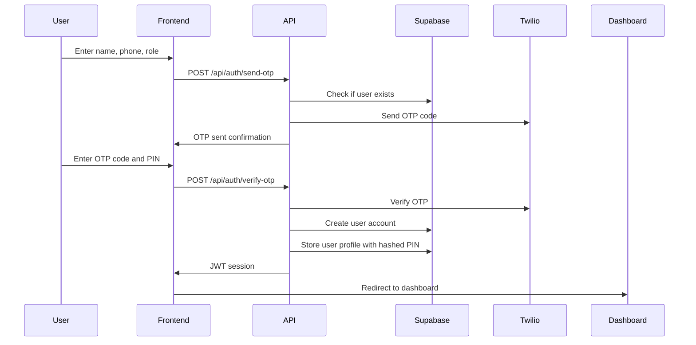
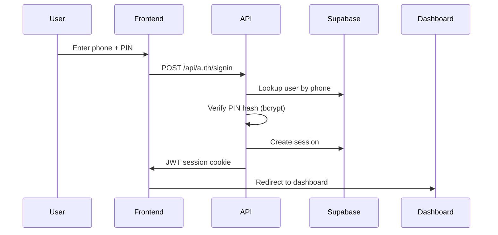

# GoTryke Authentication System Documentation

## Overview
GoTryke uses a secure, production-ready authentication system built on **Supabase** with server-side validation, PIN-based authentication, and SMS OTP verification via **Twilio**.

## Architecture

### Tech Stack
- **Supabase**: Primary backend, database, and authentication service.
- **PostgreSQL**: Core database with Row Level Security (RLS).
- **Supabase Auth**: Manages user identities and authentication.
- **JWT Sessions**: Secure httpOnly cookies for session management.
- **PIN Hashing**: `bcrypt` for secure PIN storage.
- **SMS OTP**: Phone number verification via **Twilio**.
- **Next.js Middleware**: Route protection and session validation.

### Security Features
- ✅ Server-side OTP generation and validation via **Twilio**.
- ✅ Secure PIN hashing (`bcrypt` + salt).
- ✅ httpOnly JWT cookies (XSS protection).
- ✅ CSRF protection via SameSite cookies.
- ✅ Rate limiting on auth endpoints.
- ✅ Session expiration and refresh tokens.
- ✅ **PostgreSQL RLS** for data access control.

## Setup Guide

### 1. Environment Variables

Create a `.env.local` file:

```bash
# Supabase
NEXT_PUBLIC_SUPABASE_URL="https://<your-project-ref>.supabase.co"
NEXT_PUBLIC_SUPABASE_ANON_KEY="<your-anon-key>"
SUPABASE_SERVICE_ROLE_KEY="<your-service-role-key>"

# Twilio
TWILIO_ACCOUNT_SID="ACxxxxxxxxxx"
TWILIO_AUTH_TOKEN="xxxxxxxxxx"
TWILIO_VERIFY_SERVICE_SID="VAxxxxxxxxxx"
TWILIO_FROM_PHONE="+1234567890"

# JWT Secret (Generate secure random string)
JWT_SECRET_KEY="<generate-using-openssl-rand-base64-32>"

# App Secret (For other encryption purposes)
APP_SECRET_KEY="<generate-using-openssl-rand-base64-32>"
```

### 2. Install Dependencies

```bash
npm install @supabase/supabase-js @supabase/auth-helpers-nextjs twilio bcryptjs jose
```

### 3. Supabase Setup

1. Create a new project on [Supabase](https://supabase.com/).
2. Go to **Project Settings > API** to get your URL and keys.
3. Go to **Authentication > Providers** and enable the **Phone** provider.
4. Go to **Database** and run the schema from `scripts/database-schema.sql`.

## Authentication Flows

### Sign Up Flow


### Sign In Flow


## API Endpoints

### POST /api/auth/send-otp
Send OTP to phone number for verification.

**Request:**
```json
{
  "phone": "+639123456789"
}
```

### POST /api/auth/verify-otp
Verify OTP and create user account.

**Request:**
```json
{
  "phone": "+639123456789",
  "otp": "123456",
  "name": "Juan Dela Cruz",
  "role": "passenger",
  "pin": "1234"
}
```

### POST /api/auth/signin
Sign in with phone and PIN.

**Request:**
```json
{
  "phone": "+639123456789",
  "pin": "1234"
}
```

### POST /api/auth/signout
Sign out and clear session.

### GET /api/auth/session
Get current user session.

## React Hooks Usage

### useAuth Hook
```tsx
import { useAuth } from '@/contexts/auth-context';

function MyComponent() {
  const { user, loading, signin, signout } = useAuth();
  
  if (loading) return <div>Loading...</div>;
  if (!user) return <div>Not authenticated</div>;
  
  return (
    <div>
      Welcome, {user.name}!
      <button onClick={signout}>Sign Out</button>
    </div>
  );
}
```

## Troubleshooting

### Common Issues

#### 1. OTP Not Received
- **Check:** Twilio credentials in `.env.local`.
- **Check:** Phone number format (must include country code, e.g., +63).
- **Check:** Twilio account balance.
- **Solution:** Check server logs for Twilio API errors.

#### 2. "Invalid PIN" Error
- **Check:** Ensure the PIN is being sent correctly from the client.
- **Solution:** Use the "Forgot PIN" functionality to reset.

#### 3. Supabase Errors
- **Check:** Supabase URL and keys in `.env.local`.
- **Check:** RLS policies in the Supabase dashboard.
- **Solution:** Check the browser console and server logs for specific Supabase errors.

#### 4. Middleware Not Protecting Routes
- **Check:** `middleware.ts` matcher configuration.
- **Check:** Session cookie being set correctly.
- **Solution:** Verify `JWT_SECRET_KEY` is consistent.

## Security Best Practices

1. **Environment Variables**
   - Never commit `.env.local` file.
   - Use different Supabase projects for dev/staging/prod.
   - Rotate secrets and keys periodically.

2. **PIN Management**
   - Enforce a strong PIN policy.
   - Log failed PIN attempts and implement account lockout.

3. **Session Management**
   - Use short-lived JWTs with refresh tokens.
   - Invalidate sessions on password/PIN change.

4. **Rate Limiting**
   - Implement rate limiting on all auth endpoints.

## Deployment Checklist

- [ ] Set all required environment variables in Vercel.
- [ ] Configure the production URL in Supabase Auth settings.
- [ ] Enable RLS on all tables with user data.
- [ ] Test all authentication flows in the production environment.
- [ ] Monitor serverless function logs for errors.

## Support

For issues or questions:
1. Check the troubleshooting section above.
2. Review the Vercel function logs.
3. Contact the development team.

---

*Last Updated: August 2025*
*Version: 2.0.0*
