# GoTryke System Architecture Diagrams

## High-Level System Architecture

```mermaid
graph TB
    subgraph "Users"
        Admin[👤 Admin]
        Dispatcher[🎯 Dispatcher]
        Rider[🏍️ Rider]
        Passenger[🚶 Passenger]
        Guide[📍 Guide]
    end

    subgraph "Frontend Layer"
        WebApp[🌐 Next.js Web App<br/>React 18 + TypeScript]
        PWA[📱 Progressive Web App]
    end

    subgraph "API Gateway"
        NextAPI[⚡ Next.js API Routes]
        Middleware[🛡️ Middleware<br/>Auth + Rate Limiting]
    end

    subgraph "Core Services"
        AuthSvc[🔐 Auth Service]
        UserSvc[👥 User Service]
        BookingSvc[📅 Booking Service]
        TrackingSvc[📍 Tracking Service]
        PaymentSvc[💳 Payment Service]
        NotificationSvc[🔔 Notification Service]
    end

    subgraph "External Services"
        Twilio[📨 Twilio SMS]
        Mapbox[🗺️ Mapbox Maps]
        Supabase[🔥 Supabase Suite]
        Genkit[🤖 Google Genkit AI]
    end

    subgraph "Data Storage"
        PostgreSQL[(📊 PostgreSQL DB)]
        SupabaseStorage[(💾 Supabase Storage)]
        Cache[(⚡ Redis Cache)]
    end

    Admin --> WebApp
    Dispatcher --> WebApp
    Rider --> PWA
    Passenger --> PWA
    Guide --> WebApp

    WebApp --> NextAPI
    PWA --> NextAPI
    
    NextAPI --> Middleware
    Middleware --> AuthSvc
    Middleware --> UserSvc
    Middleware --> BookingSvc
    Middleware --> TrackingSvc
    Middleware --> PaymentSvc
    Middleware --> NotificationSvc

    AuthSvc --> Twilio
    AuthSvc --> Supabase
    TrackingSvc --> Mapbox
    BookingSvc --> Genkit
    NotificationSvc --> Twilio

    AuthSvc --> PostgreSQL
    UserSvc --> PostgreSQL
    BookingSvc --> PostgreSQL
    TrackingSvc --> PostgreSQL
    PaymentSvc --> PostgreSQL

    UserSvc --> SupabaseStorage
    TrackingSvc --> Cache
```



## Authentication Flow Diagram


## Real-Time Tracking Architecture

```mermaid
graph LR
    subgraph "Rider Device"
        GPS[📍 GPS Module]
        RiderApp[📱 Rider App]
    end

    subgraph "Tracking Pipeline"
        API[🔌 Tracking API]
        Queue[📦 Event Queue]
        Processor[⚙️ Location Processor]
    end

    subgraph "Real-Time Distribution"
        SupabaseRT[🔄 Supabase Realtime]
        PubSub[📡 Pub/Sub]
    end

    subgraph "Consumers"
        Dispatcher[🖥️ Dispatcher View]
        Passenger[📱 Passenger App]
        Analytics[📊 Analytics Engine]
    end

    subgraph "Storage"
        PostgreSQL[(🔥 PostgreSQL<br/>Real-time)]
        History[(📜 Location History)]
    end

    GPS --> RiderApp
    RiderApp -->|Every 10s| API
    API --> Queue
    Queue --> Processor
    Processor --> PostgreSQL
    Processor --> History
    Processor --> PubSub
    PubSub --> SupabaseRT
    SupabaseRT --> Dispatcher
    SupabaseRT --> Passenger
    PostgreSQL --> Analytics
```



## Database Schema Structure

```mermaid
erDiagram
    USERS ||--o{ BOOKINGS : makes
    USERS ||--o{ SESSIONS : has
    USERS ||--o{ VEHICLES : owns
    USERS {
        uuid id PK
        varchar phone UK
        varchar name
        varchar role
        varchar pin_hash
        boolean is_active
        timestamp created_at
        timestamp last_login
    }

    BOOKINGS ||--|| TRIPS : creates
    BOOKINGS {
        uuid id PK
        uuid passenger_id FK
        uuid rider_id FK
        varchar status
        jsonb pickup_location
        jsonb dropoff_location
        decimal fare
        timestamp booking_time
        timestamp completed_at
    }

    TRIPS ||--o{ LOCATIONS : tracks
    TRIPS {
        uuid id PK
        uuid booking_id FK
        uuid rider_id FK
        timestamp start_time
        timestamp end_time
        decimal distance
        varchar status
    }

    LOCATIONS {
        uuid id PK
        uuid trip_id FK
        decimal latitude
        decimal longitude
        decimal speed
        timestamp "timestamp"
    }

    VEHICLES {
        uuid id PK
        uuid owner_id FK
        varchar plate_number UK
        varchar model
        varchar color
        boolean is_active
        timestamp last_maintenance
    }

    SESSIONS {
        uuid id PK
        uuid user_id FK
        varchar token
        varchar user_agent
        varchar ip_address
        timestamp created_at
        timestamp expires_at
    }

    OTPS {
        varchar phone PK
        varchar otp
        varchar name
        varchar role
        timestamp created_at
        timestamp expires_at
    }

    SECURITY_LOGS {
        uuid id PK
        varchar event_type
        uuid user_id
        varchar phone
        varchar user_agent
        varchar ip_address
        varchar risk_level
        jsonb metadata
        timestamp "timestamp"
    }
```

## Component Architecture


## Deployment Pipeline

```mermaid
graph LR
    subgraph "Development"
        LocalDev[💻 Local Development<br/>npm run dev]
        Testing[🧪 Testing<br/>Jest + Cypress]
    end

    subgraph "CI/CD Pipeline"
        GitHub[📦 GitHub]
        Actions[⚙️ GitHub Actions]
        Build[🔨 Build & Lint]
        Deploy[🚀 Deploy]
    end

    subgraph "Environments"
        Dev[🔧 Development<br/>dev.gotryke.app]
        Staging[📋 Staging<br/>staging.gotryke.app]
        Prod[🌍 Production<br/>gotryke.app]
    end

    subgraph "Infrastructure"
        Vercel[▲ Vercel<br/>Edge Functions]
        Supabase[🔥 Supabase<br/>Auth + DB]
        CDN[🌐 CDN<br/>Global Edge]
    end

    LocalDev --> Testing
    Testing --> GitHub
    GitHub --> Actions
    Actions --> Build
    Build --> Deploy
    Deploy --> Dev
    Dev --> Staging
    Staging --> Prod
    Prod --> Vercel
    Vercel --> Supabase
    Vercel --> CDN
```



## Security Architecture

```mermaid
graph TB
    subgraph "Security Layers"
        WAF[🛡️ Web Application Firewall]
        SSL[🔒 SSL/TLS Encryption]
        
        subgraph "Application Security"
            InputVal[✅ Input Validation<br/>Zod Schemas]
            RateLimit[⏱️ Rate Limiting<br/>5 attempts/15min]
            CSRF[🔐 CSRF Protection<br/>SameSite Cookies]
            XSS[🚫 XSS Protection<br/>CSP Headers]
        end
        
        subgraph "Authentication Security"
            PinHash[🔑 PIN Hashing<br/>bcrypt + Salt]
            JWT[🎫 JWT Tokens<br/>1hr Expiry]
            Session[📝 Session Management<br/>HTTP-Only Cookies]
            OTP[📱 OTP Verification<br/>10min Expiry]
        end
        
        subgraph "Data Security"
            Encryption[🔐 At-Rest Encryption]
            Transit[🔒 In-Transit Encryption]
            Backup[💾 Automated Backups]
            RLS[👥 Row Level Security]
        end
        
        subgraph "Monitoring"
            Logging[📊 Security Logging]
            Alerts[🚨 Alert System]
            Audit[📋 Audit Trail]
        end
    end

    WAF --> SSL
    SSL --> InputVal
    InputVal --> RateLimit
    RateLimit --> CSRF
    CSRF --> XSS
    XSS --> PinHash
    PinHash --> JWT
    JWT --> Session
    Session --> OTP
    OTP --> Encryption
    Encryption --> Transit
    Transit --> Backup
    Backup --> RLS
    RLS --> Logging
    Logging --> Alerts
    Alerts --> Audit
```



## Module Dependencies

```mermaid
graph TD
    subgraph "NPM Packages"
        Core[next@15.x<br/>react@18<br/>typescript@5]
        UI[tailwindcss@3.4<br/>shadcn-ui<br/>framer-motion@11]
        Supabase[supabase-js@2<br/>supabase-ssr@0.6]
        Auth[bcrypt@6<br/>jose@5]
        SMS[twilio@5]
        Maps[mapbox-gl@3<br/>react-map-gl@7]
        Forms[react-hook-form@7<br/>zod@3]
        Charts[recharts@2]
        AI[genkit-ai]
        Utils[date-fns@4<br/>clsx@2]
    end

    Core --> UI
    Core --> Supabase
    Core --> Auth
    Core --> SMS
    Core --> Maps
    Core --> Forms
    Core --> Charts
    Core --> AI
    Core --> Utils

    subgraph "Internal Modules"
        AuthModule[Authentication Module]
        UserModule[User Management]
        BookingModule[Booking System]
        TrackingModule[Real-time Tracking]
        PaymentModule[Payment Processing]
        NotificationModule[Notifications]
    end

    Supabase --> AuthModule
    Auth --> AuthModule
    SMS --> AuthModule
    Supabase --> UserModule
    Forms --> UserModule
    Supabase --> BookingModule
    AI --> BookingModule
    Maps --> TrackingModule
    Supabase --> TrackingModule
    Supabase --> PaymentModule
    SMS --> NotificationModule
```

---

## Quick Reference Card

### API Endpoints
- `POST /api/auth/signin` - User login
- `POST /api/auth/send-otp` - Send OTP for registration
- `POST /api/auth/verify-otp` - Verify OTP and create account
- `POST /api/auth/reset-pin` - Reset user PIN
- `GET /api/auth/session` - Check current session
- `POST /api/auth/signout` - Logout user

### Environment Variables Required
```bash
# Supabase
NEXT_PUBLIC_SUPABASE_URL
NEXT_PUBLIC_SUPABASE_ANON_KEY
SUPABASE_SERVICE_ROLE_KEY

# SMS
TWILIO_ACCOUNT_SID
TWILIO_AUTH_TOKEN
TWILIO_VERIFY_SERVICE_SID

# Maps
NEXT_PUBLIC_MAPBOX_TOKEN

# Security
JWT_SECRET_KEY
APP_SECRET_KEY
```

### Development Commands
```bash
npm run dev          # Start development server
npm run build        # Build for production
npm run lint         # Run ESLint
npm run typecheck    # Check TypeScript
```

---

*Generated diagrams for GoTryke Architecture*  
*Version 2.0 - August 2025*
